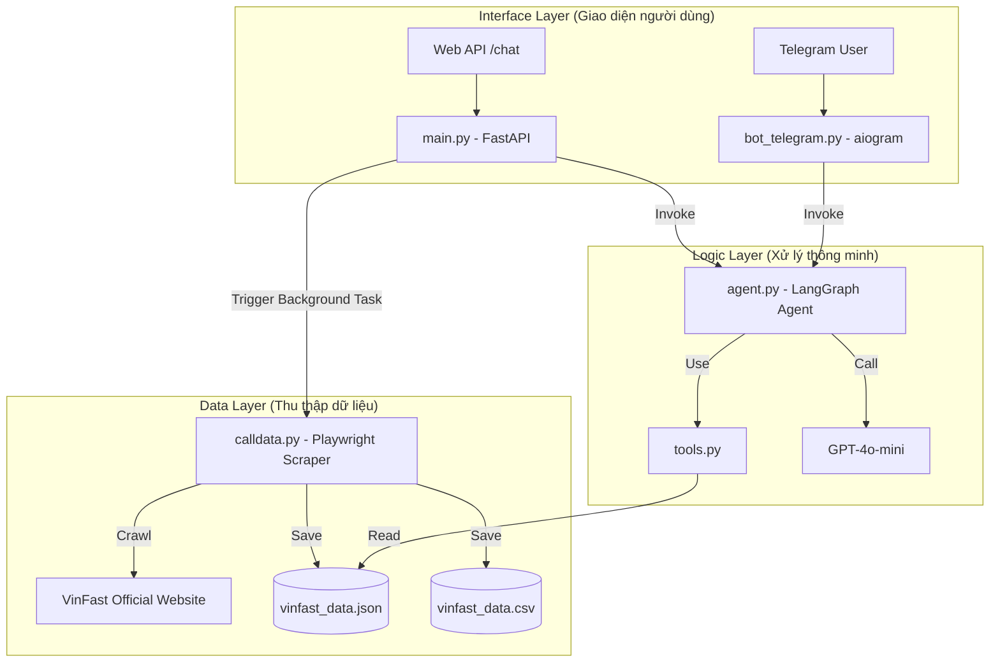

# 🏎️ VinFast Advisor Pipeline & Documentation

Tài liệu này mô tả chi tiết luồng hoạt động (pipeline) của hệ thống VinFast Advisor - Trợ lý tư vấn xe thông minh sử dụng FastAPI, LangGraph và Telegram Bot.

## 🌉 Tổng quan kiến trúc hệ thống

Kiến trúc hệ thống được xây dựng theo mô hình Agentic Workflow, kết hợp giữa việc thu thập dữ liệu tự động và xử lý ngôn ngữ tự nhiên cấp cao.


### 🔄 Luồng hoạt động chính (Pipeline)



---

## 🛠️ Chi tiết các thành phần

### 1. Thu thập dữ liệu (`calldata.py`)
- **Công nghệ:** Playwright (Chromium headless), Regex.
- **Nguồn dữ liệu:** `vinfastauto.com` và `shop.vinfastauto.com`.
- **Chức năng:** Tự động truy cập danh sách xe ô tô điện (VF-series) và xe máy điện, trích xuất:
    - Giá niêm yết (triệu đồng/VNĐ).
    - Thông số kỹ thuật (Quãng đường sạc, số chỗ ngồi, pin, tốc độ tối đa).
    - Mô tả và màu sắc.
    - Hình ảnh mô tả.
- **Output:** File `vinfast_data.json` đóng vai trò là "Kiến thức (Knowledge base)" cho Agent.

### 2. Trợ lý thông minh (`agent.py` & `tools.py`)
- **Công nghệ:** LangChain, LangGraph, OpenAI GPT-4o-mini.
- **Cơ chế hoạt động:** 
    - Sử dụng **StateGraph** để quản lý trạng thái hội thoại.
    - **Agent Node:** Phân tích ý định người dùng và quyết định sử dụng công cụ (Tool calling).
    - **Tool Node:** Thực hiện các hành động cụ thể trên dữ liệu đã thu thập.
- **Các công cụ hỗ trợ (`tools.py`):**
    - `search_cars_by_price`: Tìm xe theo ngân sách.
    - `search_by_type`: Phân loại xe ô tô/xe máy điện.
    - `recommend_car`: Gợi ý xe dựa trên nhu cầu (đi phố, gia đình, dịch vụ...).
    - `compare_cars`: So sánh chi tiết thông số giữa 2 mẫu xe.

### 3. Backend & API (`main.py`)
- **Công nghệ:** FastAPI.
- **Quản lý vòng đời (Lifespan):** Tự động khởi chạy Telegram Bot khi server startup và đóng bot an toàn khi shutdown.
- **Endpoints:**
    - `/`: Kiểm tra trạng thái hệ thống.
    - `/chat?query=...`: Cổng kết nối Agent cho các ứng dụng web khác.
    - `/crawl-data`: Kích hoạt quy trình cập nhật dữ liệu mới từ website VinFast dưới nền.

### 4. Giao diện Telegram (`bot_telegram.py`)
- **Công nghệ:** aiogram 3.x.
- **Tính năng:**
    - Tư vấn trực tiếp qua tin nhắn.
    - Lệnh `/gia_xe`: Agent tự động tổng hợp bảng giá đầy đủ.
    - Lệnh `/update`: Dành cho admin cập nhật dữ liệu mới nhất.
    - Tự động duy trì lịch sử chat theo từng User ID.

---

## 🚀 Hướng dẫn khởi chạy

1. **Cài đặt môi trường:**
   ```bash
   pip install -r requirements.txt
   playwright install chromium
   ```

2. **Cấu hình API Key:**
   Tạo file `.env` và thêm:
   ```env
   OPENAI_API_KEY=your_openai_key
   TELEGRAM_BOT_TOKEN=your_bot_token
   ```

3. **Chạy hệ thống (FastAPI + Bot):**
   ```bash
   python main.py
   ```

4. **Chỉ chạy bot (độc lập):**
   ```bash
   python bot_telegram.py
   ```

---
> [!TIP]
> Hệ thống này được thiết kế theo hướng module hóa cao. Bạn có thể dễ dàng bổ sung thêm công cụ mới trong `tools.py` để mở rộng khả năng của Agent (ví dụ: tính toán trả góp, tìm showroom gần nhất).
